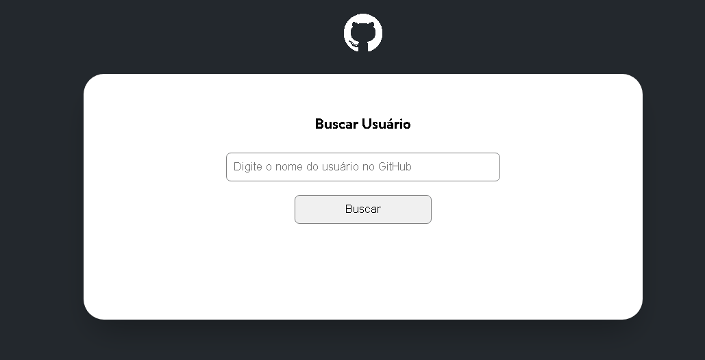

# API GitHub 

 
 

# Descrição do Projeto

Projeto Desenvolvido como quest final do módulo avançado de JavaScript. Trata-se de um sistema com consumo da API do Github, que retorna dados do usuario pesquisado

 
 

# O que aprendi 🤓

Foi o projeto mais complexo no qual trabalhei, foram coisas que de fato sei que vou usar durante minha carreira, desde tecnicas de exportação de arquivos, a funcionalidades, como fazer a pesquisa através da tecla 'Enter' a o real consumo da api, com manipulação do DOM e etc.

 
 

# Tecnologias Utilizadas 🛠

-   # HTML
-   # CSS
-   # JavaScript
 
 

# Projeto Funcionando 💻

 

 
 

